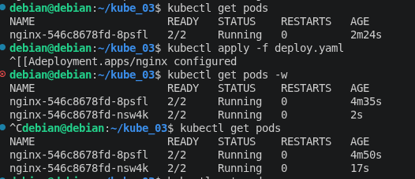
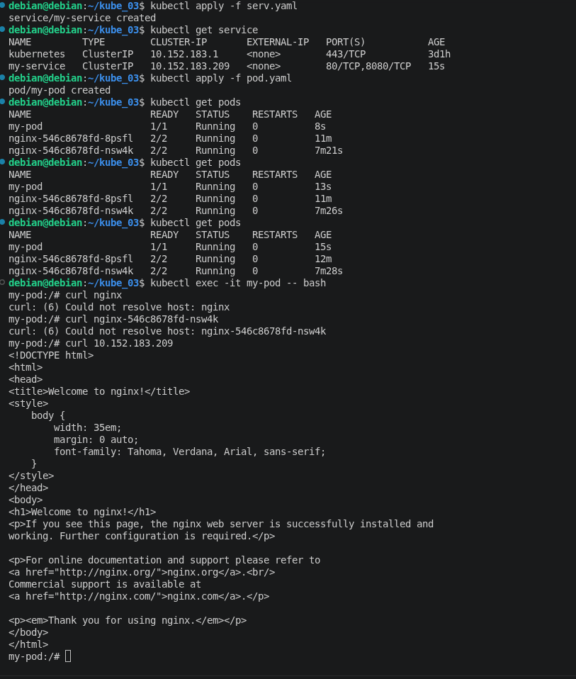
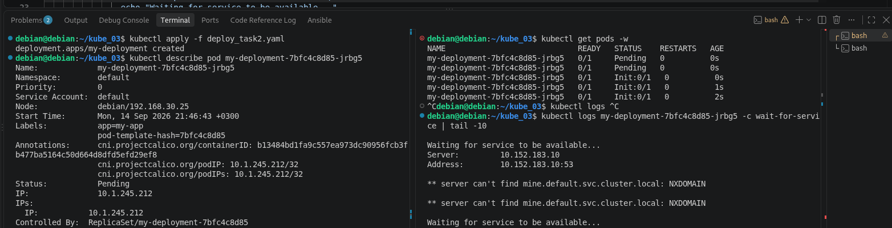
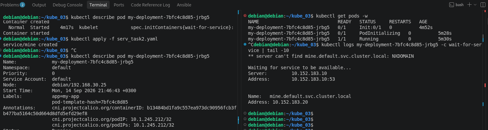

## kube_03
# Task 1

> Манифесты к заданию   

    [Deploy]:(https://github.com/ufilin/kube_03/blob/main/deploy_task1.yaml)  
    [Service]:(https://github.com/ufilin/kube_03/blob/main/serv_task1.yaml)  
    [Pod]:(https://github.com/ufilin/kube_03/blob/main/pod_task1.yaml)  

Pods до и после масштабирования

  

Проверка доступа из отдельного podа через curl наличие доступа к deploy приложениям

  

# Task 2

> Манифесты к заданию  

    [Deploy]:(https://github.com/ufilin/kube_03/blob/main/deploy_task2.yaml)  
    [Service]:(https://github.com/ufilin/kube_03/blob/main/serv_task2.yaml)  

Создание deploy приложения nginx, без сервиса не стартует

  

Запущен сервис, Pod переходит в состояние running

  

